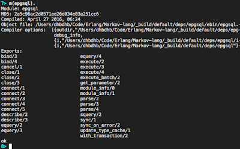
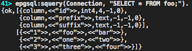
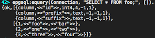

In the [last post](/2016/04/28/postgres-erlang-on-os-x-part-1) we got [epgsql](https://github.com/wg/epgsql) running inside our Erlang REPL.  Now we are going to start using epgsql.  

Start your Postgres server and open up your REPL.  Make sure epgsql is loaded by running:

```
m(epgsql).
```

If it's there you will see the module's information:  
  



  
To connect to our database we run:  

```
{ok, Connection} = epgsql:connect("<hostname>", "<username>", "<password>", [{database, "<dbname>"}]).
```

This will return a connection that we can then use to interact with the database.  
  
To create a table by running the following Simple Query:  

```
{ok, [], []} = epgsql:squery(Connection, "CREATE TABLE foo (id SERIAL PRIMARY KEY, prefix TEXT, suffix TEXT);").
```

Now to insert data into our database we run:  

```
{ok, 1} = epgsql:squery(Connection, "INSERT INTO foo (prefix, suffix) VALUES ('foo', 'bar');").
```

This returns `{ok, N}`, where N is the number of rows inserted.  Lets go head and add two more items into out database:  

```
{ok, 2} = epgsql:squery(Connection, "INSERT INTO foo  (prefix, suffix) VALUES ('one', 'two'), ('three', 'four');").
```

In order to query our database we can use a simple query  

```
{ok, Cols, Rows} = epgsql:squery(Connection, "SELECT * FROM foo;").
```

This will return all the data in the row as binary data:  
  



In order to get data returned typed correctly we need to use an extended query:

```
{ok, Cols, Rows} = epgsql:equery(Connection, "SELECT * FROM foo;", []).
```

As you can see, the id column is an integer now, the strings are still binary.  However, if we had booleans they would be returned as boolean values, etc.  
  



That's how you can connect to and get data in and out of a Postgres database using Erlang.

Now lets close the connection by running:

```
epgsql:close(Connection).
```
