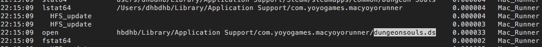
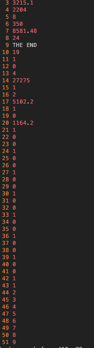
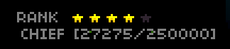
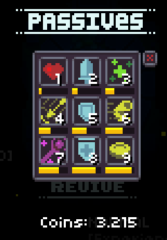
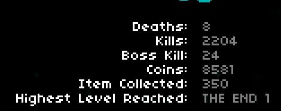
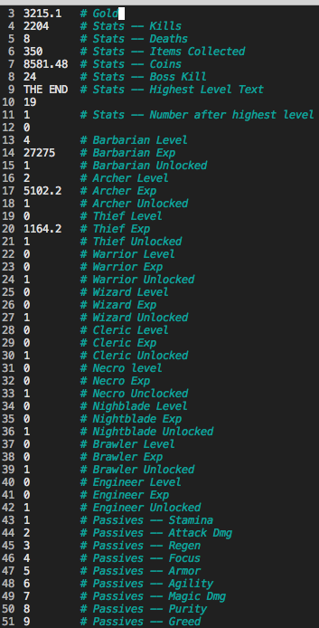
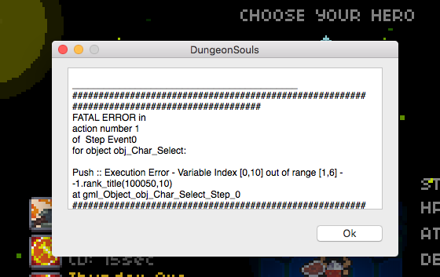
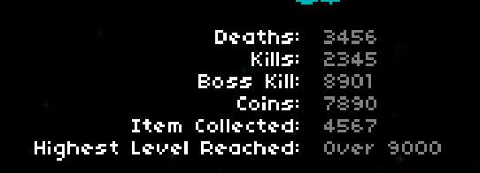

# Dungeon Souls Save Edit

I’ve been playing a game called [Dungeon Souls](http://store.steampowered.com/app/383230/). It’s a rouge like that difficult at first, but then becomes extremely fun once you get the hang of it.

After playing for a bit, I started messing around with [Bit-Slicer](https://github.com/zorgiepoo/Bit-Slicer) to give myself massive HP regen and a bunch of damage, I wanted to do something a bit more fun. I wanted to edit my save.

A quick Google search for the save location came up empty. I needed to watch which files the process interacted with during so I could find them.

To do this I ran `sudo fs_usage | grep Mac | less`. I then launched and exited the game which generated a nice list of file system usage. While browsing through the results a file called `dungeonsouls.ds` caught my eye.

Upon opening the file, you are greeted with 51 lines of information. It was time to trace these values back to the game.

Time to boot up the game and see if we can find anything that looks like these values.

Oh hey look at that, 4 stars and 27275 experience. I think we found our Barbarian!

Woot passives and gold are found.

And our stats…

After poking around, the save file breaks down as follows:

Unfortunately, I couldn’t figure out what lines 1, 2, 10, and 12 are for.

Passives are capped at 10 and setting them past that doesn’t work.

Based on previous behaviors I saw during my time with Bit-Slicer, setting the experience past the current amount needed for the current level results in one level increase and the experience being reset to 0.

The unlock toggle is `0` for locked `1` for unlocked. It does not work for the Barbarian, Thief, and Archer as they are the default chars.

Do not set the class level outside 0 - 5. You will cause an index out of bounds error and crash the game.

If stats require a numeric value, but receive a string, they are set to 0 in the game.

Just having some funsies with highest level text:

