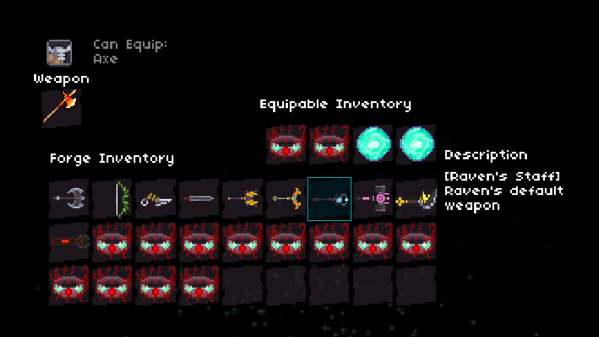

# Dungeon Souls Save Editing, Part 2

After hacking away at the character safe information, I wanted to take a crack at understanding the weapons system.

In `~/Libaray/Application Support/com.yoyogames.macyoyorunner` there’s a grip of files realted to the Arcane Forge.

In order to give ourselves items we want to look at `arc_frg_itm.ds`.

This is a list of numbers which corresponds to various weapons. The breakdown is:

| Number | Item |
| --- | --- |
| 0 | Barbarian’s Axe (Barbarian’s default) |
| 1 | Viking’s Axe (Viking’s() default) |
| 2 | Archer’s Bow (Archer’s default) |
| 3 | Viper (Ranger’s() defualt) |
| 4 | Thief’s Knife (Thief’s default) |
| 5 | Rouge’s Knife (Rouge’s() default) |
| 6 | Warrior’s Sword (Warrior’s default) |
| 7 | Knight’s Sword (Knight’s() default) |
| 8 | Wizard’s Staff (Wizard’s default) |
| 9 | Archmage’s Staff (Archmage’s() default) |
| 10 | Cleric’s Staff (Cleric’s default) |
| 11 | Paladin’s Staff (Paladin’s() default) |
| 12 | Necromancer’s Scepter (Necromancer’s default) |
| 13 | Raven’s Staff (Raven’s() default) |
| 14 | Nightblade’s Scepter (Nightblade’s default) |
| 15 | Destroyer’s Hammer (Destroyer’s() default) |
| 16 | Brawler’s Mace (Brawler’s default) |
| 17 | Naginata (Duelist’s() default) |
| 18 | Engineer’s Wrench (Engineer’s default) |
| 19 | Mechanic’s Wrench (Mechanic’s() default) |
| 20 | Fire Sword |
| 21 | Fire Staff |
| 22 | Fire Dagger |
| 23 | Fire Axe |
| 24 | Fire Scepter |
| 25 | Fire Bow |
| 26 | Ice Sword |
| 27 | Ice Dagger |
| 28 | Ice Staff |
| 29 | Ice Scepter |
| 30 | Ice Bow |
| 31 | Ice Axe |
| 32 | Poltergeist Bow |
| 33 | Poltergeist Dagger |
| 34 | Poltergeist Staff |
| 35 | Ninby’s Grace |
| 36 | Maps back to 15 |
| 37 | Murderer’s Ring |

When supplying numbers outside this range you can crash the game. I could not get consistent behavior on the crash. One time it was an index out of range, another time it was indexing an object that wasn’t indexible.

When it handles bad values correctly it defaults them to the Barbarian’s Axe.

We notice there’s some interesting characters mentioned that aren’t in the game. There’s the `Viking`, `Viper`, `Rogue`, `Knight`, `Archmage`, `Paladin`, `Raven`, `Destroyer`, `Duelist`, and `Mechanic`. Their default weapons can be seen below with a bunch of Murderer’s Rings.

From what I can tell it looks like they will be an upgraded version of the base version of each character.

