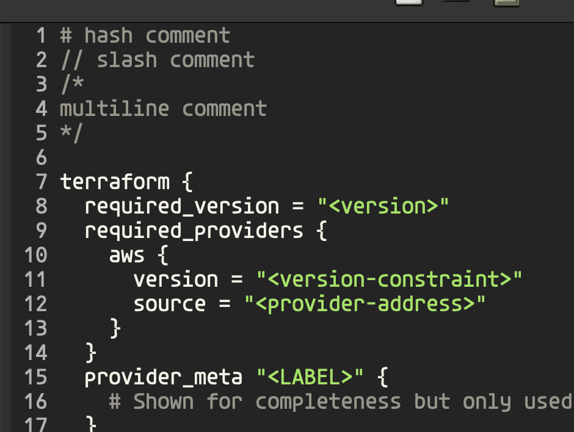
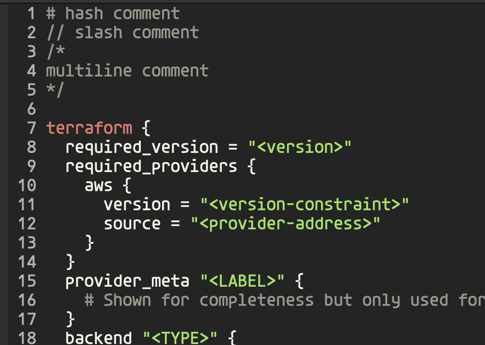
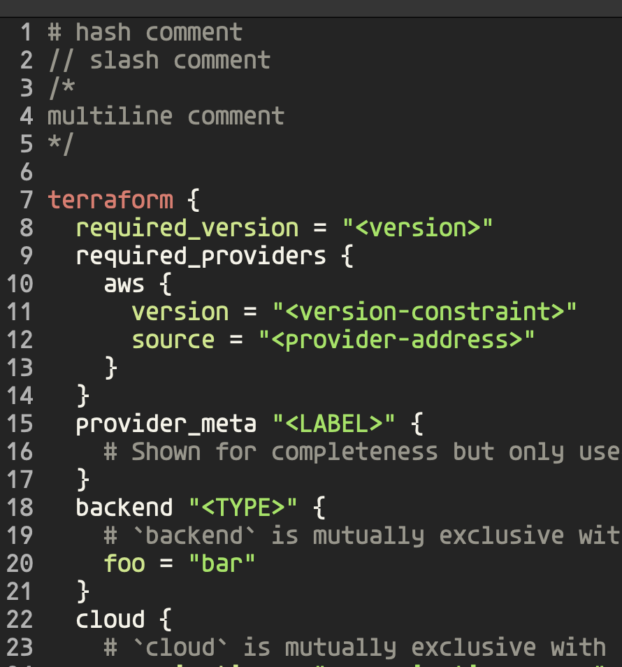

A goal of mine has been rewriting
[terraform-mode](https://github.com/hcl-emacs/terraform-mode). The current
implemenation has some minor bugs that are annoying. It depends on hcl-mode
which introduces complexity in being able to rewrite it. Another goal of mine
is to have it extensively tested to prevent regressions.

The end result of this exercise will be a `terraform-mode` version 2.0.

## Identifying Comments

We start off by identfying our comments. We use the `b` style comment for
single line comments and we use `a` style comments for multiline.

```lisp
(defvar terraform-mode-syntax-table
  (let ((table (make-syntax-table)))
    ;; # and // are line comments (style b); /* */ are block comments (style a)
    (modify-syntax-entry ?# "< b" table)
    (modify-syntax-entry ?\n "> b" table)
    (modify-syntax-entry ?/ ". 124b" table)
    (modify-syntax-entry ?* ". 23" table)
    ...
    table)
    "Syntax table for `terraform-mode'.")
```

For the `#` style comments `< b` means this is a single characeter comment
starter for `b` type comments.

For `\n` the `> b` means this is what terminates a single line comment.

For `/` the `. 124b` compacts a lot of information.
    - The `.` means it's a punctuation character class.
    - The `1` means it's the start of a two character start comment sequence.
    - The `2` means its the second character of a two character start comment sequence.
    - The `4` means its the last character of a two character end comment sequence.
    - The `b` applies to the second time `/` shows up making it a `b` style comment.

For `*` the `. 23` finsihes the multiline comment support.
    - The `.` serves the same purpose as before.
    - The `2` means the same thing as well.
    - The `3` means it's the first character in a 2 character end sequence.



## Brackets

```lisp
(defvar terraform-mode-syntax-table
  (let ((table (make-syntax-table)))
    ...
    (modify-syntax-entry ?{ "(}" table)
    (modify-syntax-entry ?} "){" table)
    (modify-syntax-entry ?\[ "(]" table)
    (modify-syntax-entry ?\] ")[" table)
    (modify-syntax-entry ?\( "()" table)
    (modify-syntax-entry ?\) ")(" table)
    table)
    "Syntax table for `terraform-mode'.")
```

For the open curly brace `?{ "(}"` says `{` is an open brace and its matching
closing brace is `}`.

For the close curly brace `?} "){"` says `}` is a close brace and its matching
open brace is `{`.

I won't explain the rest of the table modifications beacuse it's the same
thing over and over for the difference braces.

## Creating the mode

In order to create the mode is derived from `prog-mode`.

```lisp
;;;###autoload
(define-derived-mode terraform-mode prog-mode "Terraform"
  "Major mode for editing Terraform files."
  :syntax-table terraform-mode-syntax-table
  (setq-local comment-start "#")
  (setq-local comment-end "")
  (setq-local font-lock-defaults '(nil nil nil)))

;;;###autoload
(add-to-list 'auto-mode-alist '("\\.tf\\'" . terraform-mode))
;;;###autoload
(add-to-list 'auto-mode-alist '("\\.tfvars\\'" . terraform-mode))

(provide 'terraform-mode)
```

At this point when we open a Terraform file it no highlighting works outside
of comments.

## First Keyword

Now we want to introduce syntax highlighting for the `terraform` builtin word.
In order to do this we craft a regexp using the `rx` macro:

```lisp
(defconst terraform-mode--block-builtins-no-type-or-name
  (rx line-start (zero-or-more space) (group "terraform")))
```

Then we configure the table we'll pass to `font-lock-defaults`:

```lisp
(defconst terraform-mode--font-lock-keywords
  `((,terraform-mode--block-builtins-no-type-or-name 1 font-lock-builtin-face)))
```

The `,` in `,terraform-mode--block-builtins-no-type-or-name` exapnds the
macro within the quoted list. The `1` says to apply face
`font-lock-builtin-face` to the first capture group.

Then we update our `font-lock-defaults` from above to use our table:

```lisp
(setq-local font-lock-defaults '(terraform-mode--font-lock-keywords nil nil))
```



## Handling Variables

When writing terraform we use `_` a lot as part of variable names. We need to
treat this as part of words instead of as punction. This is achieved by:

```lisp
(modify-syntax-entry ?_ "w" table)
```

Then we can write our regexp to capture assignment statements:

```lisp
(defconst terraform-mode--variable
  (rx line-start (zero-or-more space) (group (one-or-more word)) (zero-or-more space) "="))
```

Then we add this to our `font-lock-keywords` table and assignment statements
are properly highlighted.



We'll continue iterating on this in the next post.
