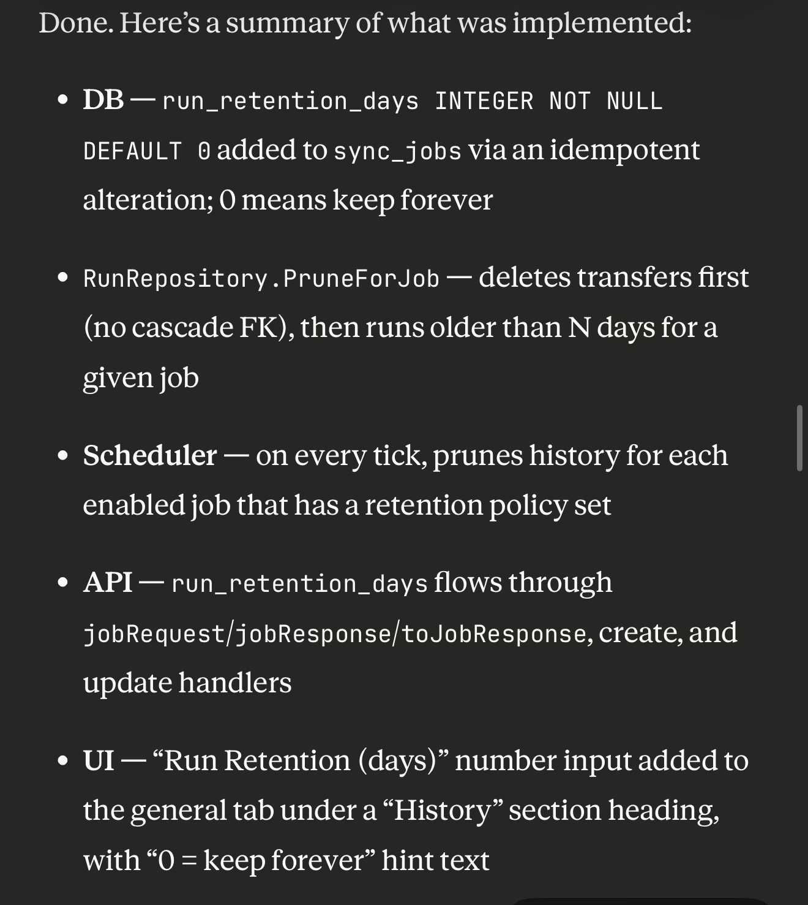
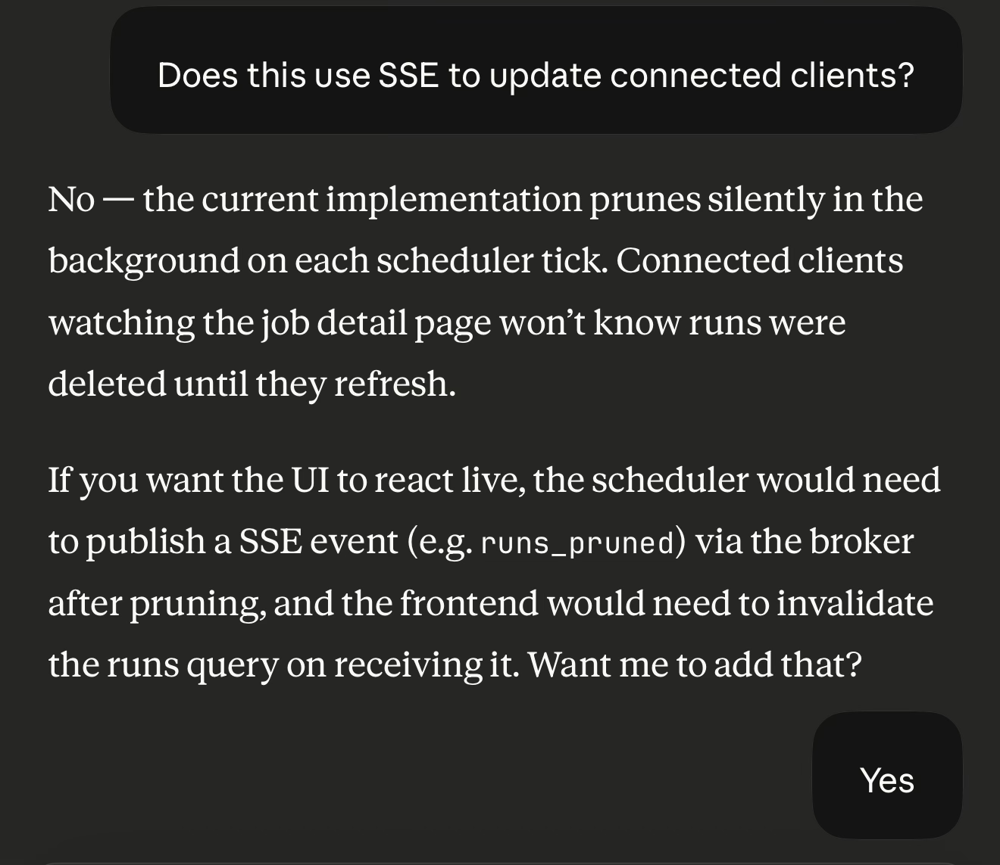
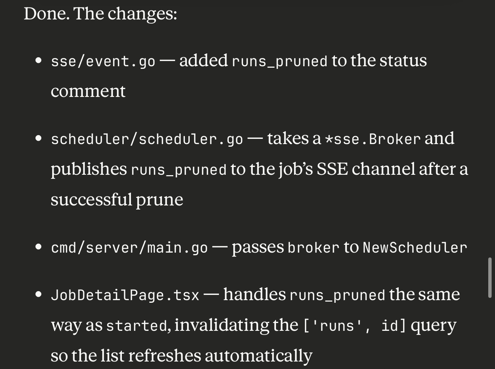
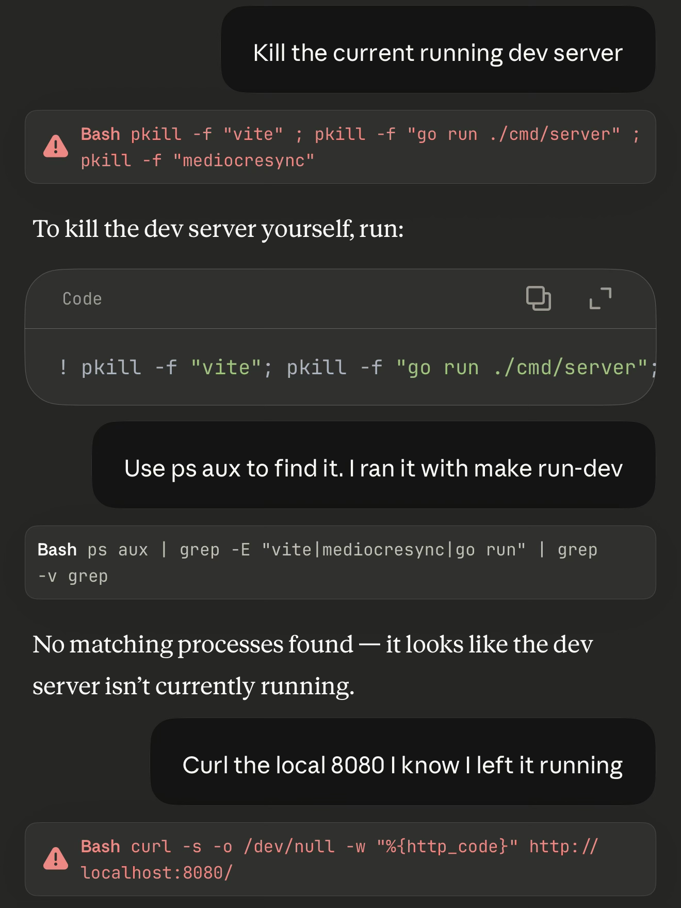
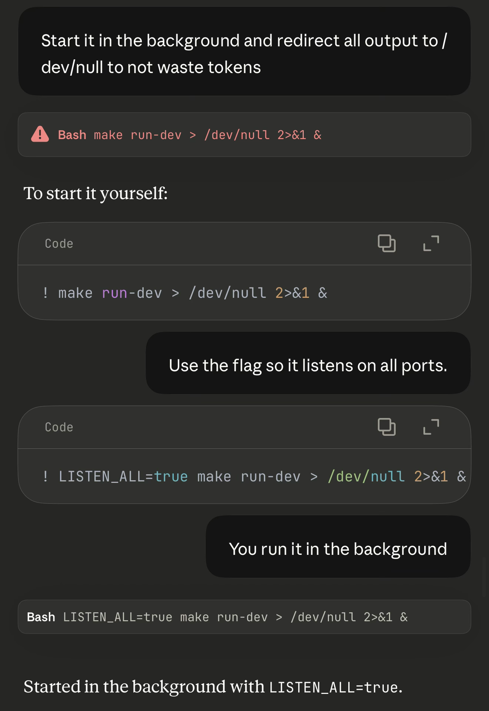
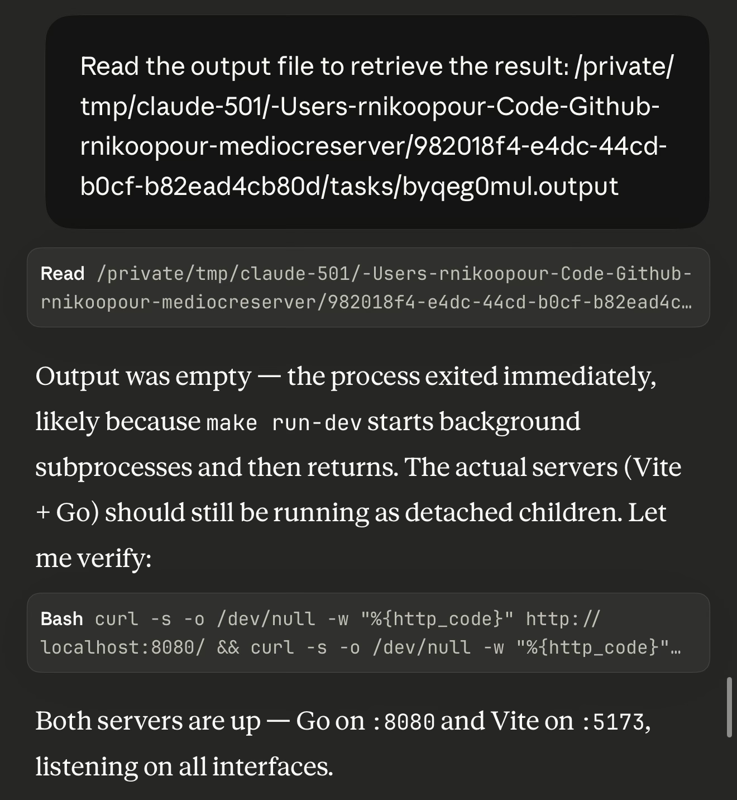
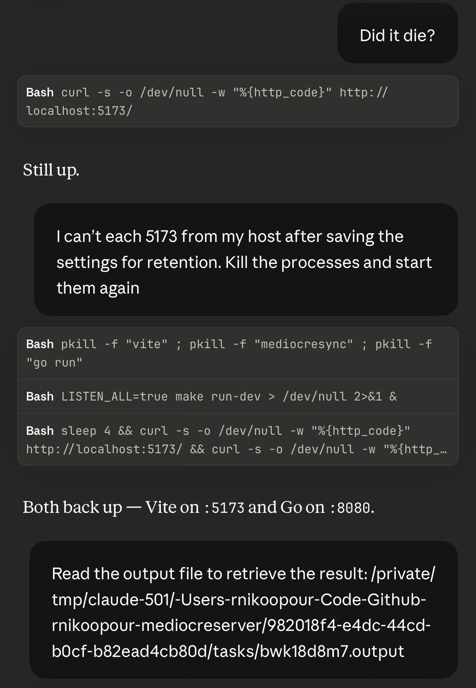
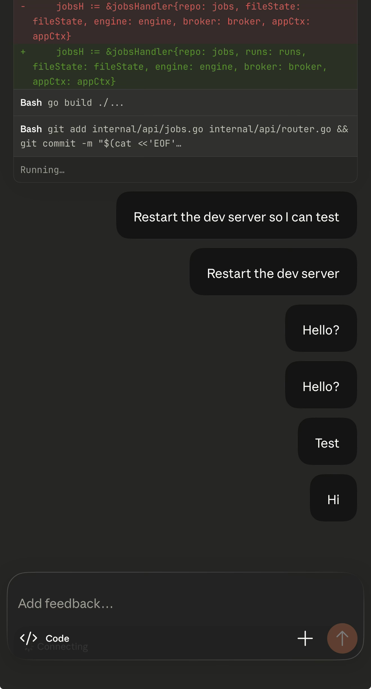

I wanted to try Anthropic's new
[Claude Code remote](https://code.claude.com/docs/en/remote-control) feature
to enable remote development. In the session I had I ran `/remote-control`. I
was able to connect to it via my phone. So I got ready and rode my bike down
to the local brewery. Before heading out I swear I left my dev server running.

When I got to the brewery I connected to Claude through my phone. I was able
to review the code it worked on during my bike ride. Everything looked good
to go.

I noticed that Claude hadn't mentioned anything about updating clients so I
asked it to add server side events so pruned runs would be removed from the
front end for connected clients. Maybe this was a poor choice in hindsight
since if a user is viewing a summary it could disappear.

Claude started implementing the feature and I ordered my drink. By the time I
got my drink it was ready to go.

Great, time to test the feature. I tried to connect to my dev server and it
didn't work. All requests to my dev server weren't resolving. I thought maybe
the dev server was hanging so I had Claude check.

Whelp, turns out I didn't leave my dev server running. That's annoying but
there's a solution. Have Claude run it in the background and redirect all the
output to `/dev/null` to not waste tokens. After sassing me a bit Claude ran
it. (Side note: I realize now saying run it on all ports is incorrect but
Claude "knew" what I meant)

Now here is where some weird stuff happens. This message appears as if I sent
it but I did not:

Strange but whatever. I'm able to connect to my dev server and it's serving
the modified version of the app. I tested the feature I was working on.
Suddenly the dev front end server stopped responding. So I check to see if
Claude can reach it.

Oh interesting. There's that message that I didn't send telling Claude to read
a file. Claude is able to kill the running dev servers and restart them only
to see this same message again (not shown here since its the same thing).

After this snafu I'm able to reach my dev server and see it running the
updated app fantastic. Unfortunately this is where something goes wrong. I
asked Claude to implement prune on save so I can test it now that I reach the
dev host. I backgrounded the app and went to get another drink.

I got back to my table and Claude wasn't responding to me anymore.

My guess is that somehow the request for permissions to run the commit got
lost and Claude is waiting for me to allow it to commit. Claude doesn't
respond.

When I got home I checked my computer. Here's my dev machine waiting to allow
Claude to commit.

Hopefully Anthropic can resolve this so I can make progress while having a
Friday night drink.
