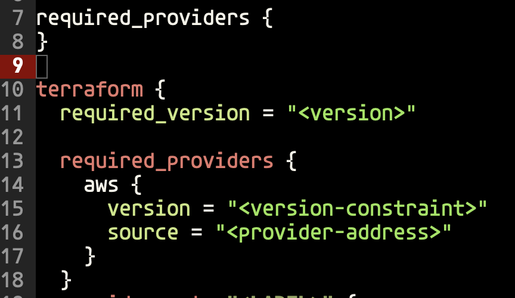
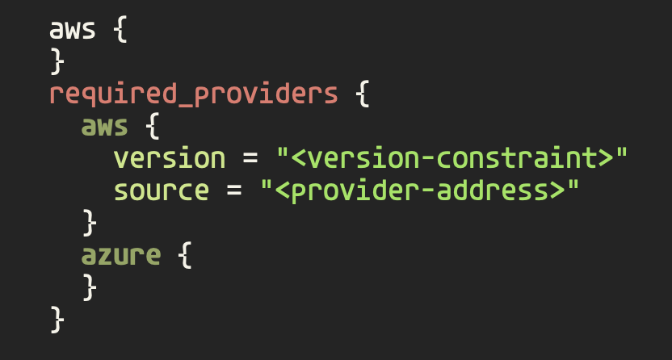
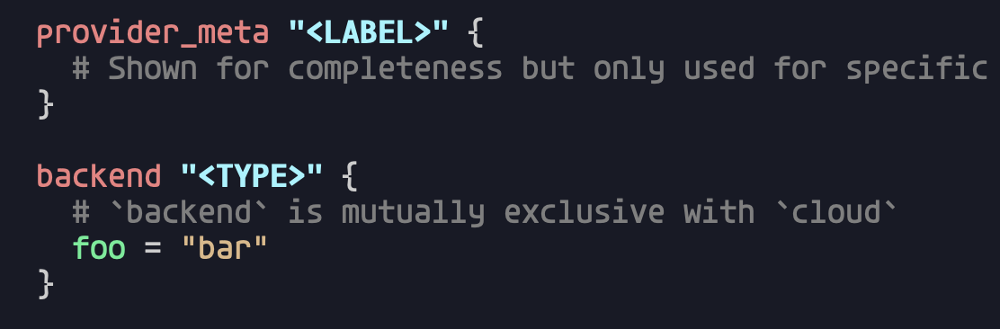

This is continuing from the [last Terraform Mode v2.0 post](../2026-03-17-terraform-mode-v2.0/index.md).

## Fixing a Previous Mistake

So using `terraform-mode--variable` is a bad choice since Terraform has variables.
We're going to change this to `terraform-mode--assignment` to accurately capture
what it's highlighting and let us be able to highlight variables with an appropriately
named function.

```lisp
(defconst terraform-mode--assignment
       (rx line-start (zero-or-more space) (group (one-or-more word)) (zero-or-more space) "="))
```

## Depth Based Highlighting

Next we want to add some more highlighting for certain built in words. Words
like `cloud` and `required_providers` only need highlighting when they're at
depth 1. We can use `syntax-ppss` to understand information about where the
curor is. It tells us information like brace depth, if it's in a string or
comment, etc. The zeroeth element of its return tells us the brace depth.

```lisp
(defun terraform-mode--match-builtin-at-depth (regexp depth limit)
    (and (re-search-forward regexp limit t)
        (= (nth 0 (syntax-ppss (match-beginning 0))) depth)))
```

We then use this to apply syntax highlighting by passing a wrapped version of
this function to our `font-lock-keywords` since it can take regexps or function
to use for matching.

```lisp
(defconst terraform-mode--block-builtins-depth-0
  (rx line-start (zero-or-more space) (group "terraform")))

(defun terraform-mode--match-depth-0-builtin (limit)
  (terraform-mode--match-builtin-at-depth terraform-mode--block-builtins-depth-0 0 limit))

(defconst terraform-mode--block-builtins-depth-1
  (rx line-start (zero-or-more space) (group (or "required_providers" "cloud"))))

(defun terraform-mode--match-depth-1-builtin (limit)
  (terraform-mode--match-builtin-at-depth terraform-mode--block-builtins-depth-1 1 limit))

(defconst terraform-mode--block-builtins-depth-2
  (rx line-start (zero-or-more space) (group "workspaces")))

(defun terraform-mode--match-depth-2-builtin (limit)
  (terraform-mode--match-builtin-at-depth terraform-mode--block-builtins-depth-2 2 limit))

(defconst terraform-mode--font-lock-keywords
  `((terraform-mode--match-depth-0-builtin 1 font-lock-builtin-face)
    (terraform-mode--match-depth-1-builtin 1 font-lock-builtin-face)
    (terraform-mode--match-depth-2-builtin 1 font-lock-builtin-face)
    ; ...
    (,terraform-mode--assignment 1 font-lock-variable-name-face)))
```

Now we have depth aware syntax highlighting so we don't inadveratntly highlight
text.



## Using Text Properties to Highlight

Now we want to highlight the providers inside `required_providers`. We could use
depth to check for this, but that is error prone cuz of nesting in other situations.
Instead we'll need to use custom text properties to be able to mark the region and
highlight based off of that.

```lisp
(defconst terraform-mode--required-providers-block
  (rx line-start (zero-or-more space) "required_providers" (zero-or-more space) "{"))

(defun terraform-mode--propertize-required-providers (start end)
  "Mark contents of required_providers blocks with a text property.
Only marks the portion of each block that overlaps with [START, END)."
  (remove-text-properties start end '(terraform-mode-required-providers nil))
  (save-excursion
    (goto-char (point-min))
    (while (re-search-forward terraform-mode--required-providers-block nil t)
      (let ((content-start (point)))
        (save-excursion
          (backward-char)
          (condition-case nil
              (progn
                (forward-sexp)
                (let ((content-end (1- (point))))
                  (when (and (> content-end content-start)
                             (> content-end start)
                             (< content-start end))
                    (put-text-property
                     (max content-start start)
                     (min content-end end)
                     'terraform-mode-required-providers t))))
            (error nil)))))))

(defun terraform-mode--syntax-propertize (start end)
  "Propertize region from START to END."
  (terraform-mode--propertize-required-providers start end))

(define-derived-mode terraform-mode prog-mode "Terraform"
  "Major mode for editing Terraform files."
  :syntax-table terraform-mode-syntax-table
  ;; ...
  (setq-local syntax-propertize-function #'terraform-mode--syntax-propertize))
```

We use `terraform-mode--propertize-required-providers` to clear the previous
region to prevent stale font properties. We go back to the start of the file
and search for `required_providers`. If we find it we identify its entire block
and we add the property to identify it as a providers section.

Now that we can identify when we're in a `required_providers` we can highlight
providers properly using a function to check if what we want to highlight is
propertized.

```lisp
(defconst terraform-mode--provider
  (rx line-start (zero-or-more space) (group (one-or-more word)) (one-or-more space) "{"))

(defun terraform-mode--match-provider (limit)
  "Match provider names inside required_providers blocks up to LIMIT."
  (catch 'found
    (while (re-search-forward terraform-mode--provider limit t)
      (when (get-text-property (match-beginning 0) 'terraform-mode-required-providers)
        (throw 'found t)))))

(defconst terraform-mode--font-lock-keywords
    ; ...
    (terraform-mode--match-provider 1 font-lock-type-face))
```



## Overriding Syntactic Highlighting

Emacs breaks highlighting into two phases syntactic highlighting and
fontification. Syntactic highlighting identifies the syntactic structure of
the code for navigation and also highlights strings and comments. Then comes
fontification which enables us to apply custom highlighting. However, in
Terraform the code uses string markers for identifying block types and resource
types/names. Fontification provides a way for us to force syntax highlighting
by passing `t` in `font-lock-keywords`. This creates an issue though because
it will always override syntactic highlighting and we end up with highlighting
in incorrect places like comments. We can use `syntax-propertize` again to
override what a string is in certain scenarios.

```lisp
(eval-and-compile
  (defconst terraform-mode--block-builtins-with-type
    (rx line-start (zero-or-more space)
    (group (or "backend" "provider_meta"))
    (one-or-more space)
    (group (group "\"") (one-or-more (not (any "\""))) (group "\""))
    (zero-or-more space) "{")))

(defun terraform-mode--propertize-builtins-with-type (start end)
  "Mark type argument quotes in builtin-with-type blocks as punctuation syntax.
This prevents them from receiving `font-lock-string-face' during syntactic
fontification, allowing `font-lock-type-face' to be applied without override."
  (goto-char start)
  (funcall
   (syntax-propertize-rules
    (terraform-mode--block-builtins-with-type
     (3 ".")
     (4 ".")))
   start end))

(defun terraform-mode--syntax-propertize (start end)
  "Propertize region from START to END."
  (terraform-mode--propertize-builtins-with-type start end)
  (terraform-mode--propertize-required-providers start end))

(defconst terraform-mode--font-lock-keywords
  `(; ...
    (,terraform-mode--block-builtins-with-type
     (1 font-lock-builtin-face)
     (2 font-lock-type-face))))
```

When we match `backend "type" {` we mark those `"` as punctuation instead of
marking it as a string. (Using a different theme in this screenshot to really
emphasize the differnet in string vs type.


